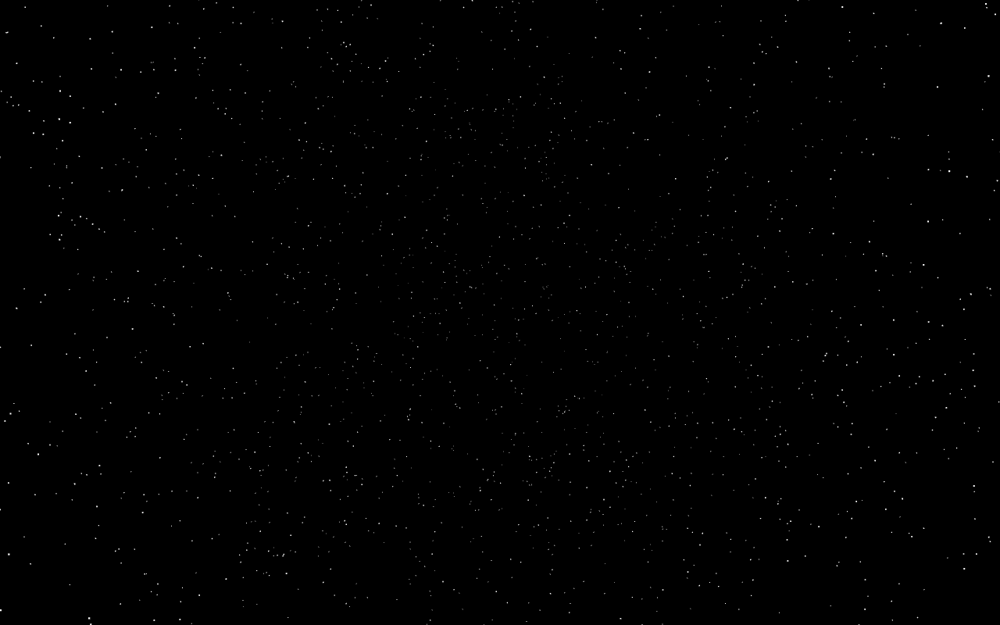

# Quick way to add stars to your A-Frame project



* [Basic Usage](#basic-usage)
* [Demo](#demo)
* [Properties](#properties)
* [Random Links](#random-links)

## Basic Usage

Getting started is easy, just import A-Frame and Star-System:

``` html
<!DOCTYPE html>
<html>
<head>
    <script src="https://cdnjs.cloudflare.com/ajax/libs/aframe/0.6.1/aframe-master.js"></script>
    <script src="https://cdn.rawgit.com/matthewbryancurtis/aframe-star-system-component/db4f1030/index.js"></script>
</head>
<body>
    <a-scene>
        <a-sky color="black"></a-sky>
        <a-entity star-system></a-entity>
    </a-scene>
</body>
</html>
```

If things get bogged down, you may try less particles (stars):

``` html
<a-entity star-system="count: 1000; radius: 250; depth: 0"></a-entity>
```

But you also might want to try more:

``` html
<a-entity star-system="count: 100000"></a-entity>
```

Or offset the sphere of stars:

``` html
<a-entity position="0 0 -250" star-system></a-entity>
```

If for some reason square stars bother you, you can use a custom image to replace the stars:

``` html
<a-entity star-system="texture: https://cdn.rawgit.com/matthewbryancurtis/aframe-star-system-component/master/assets/star.svg"></a-entity>
```

# Demo

[Demo Link](https://matthewbryancurtis.github.io/aframe-star-system-component/)

Demo code:

``` html
<!DOCTYPE html>
<html>
<head>
    <script src="https://cdnjs.cloudflare.com/ajax/libs/aframe/0.6.1/aframe-master.js"></script>
    <script src="https://cdn.rawgit.com/matthewbryancurtis/aframe-star-system-component/db4f1030/index.js"></script>
</head>
<body>
    <a-scene>
        <a-sky color="black"></a-sky>
        <a-entity star-system></a-entity>
    </a-scene>
</body>
</html>
```

## Properties

The way this works is it creates a bunch of particles (stars) in THREE. The particles are randomly placed between two spheres: sphere of radius 'radius' and sphere of radius 'radius + depth'. You can also load a custom sprite to replace the squares that THREE.PointsMaterial() makes.

| Property    | Type   | Default | Description                                         |
|-------------|--------|---------|-----------------------------------------------------|
| color       | String | '#FFF'  | Color of the star particles                         |
| radius      | Number | 300     | Distance from center of sphere to inner star sphere |
| depth       | Number | 300     | Distance between inner sphere and outer sphere      |
| size        | Number | 1       | Size of each individual star                        |
| count       | Number | 10000   | Number of total stars created                       |
| texture     | Asset  | ''      | Sprite used for individual stars (ex: PNG image)    |

## Random Links

* [Star-System on NPM](https://www.npmjs.com/package/aframe-star-system-component)
* [I'm looking for a job](http://matthewbryancurtis.com/)
